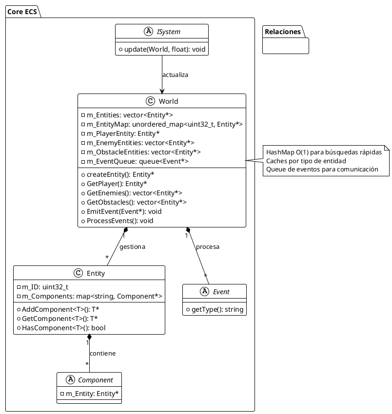
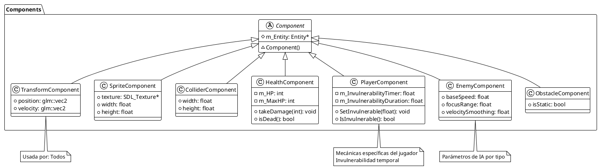
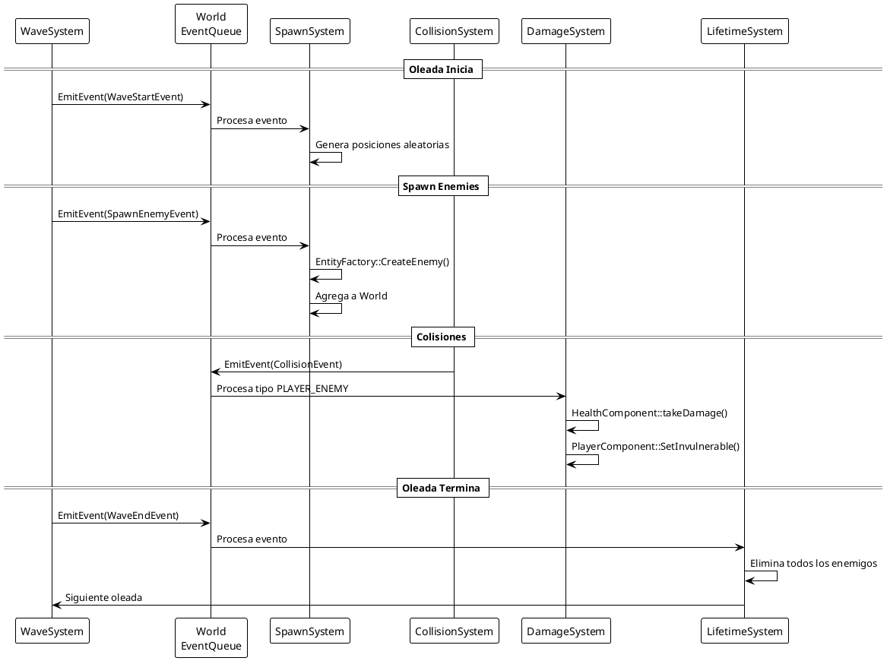
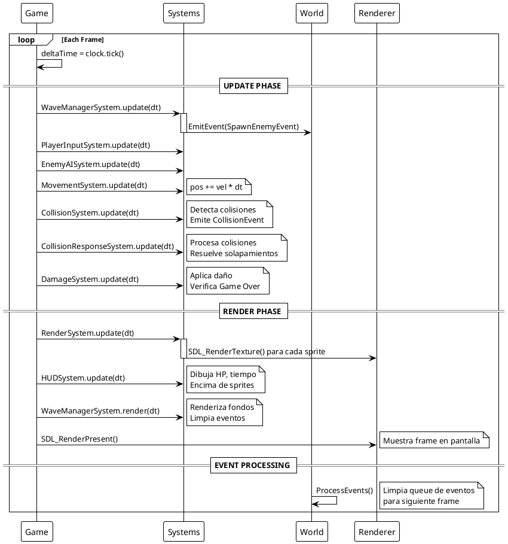

# 🏗️ Arquitectura del Proyecto - EXAMEN3

## Tabla de Contenidos
1. [Visión General](#visión-general)
2. [Diagrama de Clases](#diagrama-de-clases)
3. [Patrón ECS](#patrón-ecs)
4. [Flujo de Eventos](#flujo-de-eventos)
5. [Ciclo Update-Render](#ciclo-update-render)
6. [Patrones de Diseño](#patrones-de-diseño)

---

## Visión General

El proyecto utiliza una **arquitectura ECS (Entity Component System)** que separa:
- **Datos** (Components)
- **Lógica** (Systems)
- **Coordinación** (World, Game)

Esta separación permite:
- ✅ Máxima reusabilidad de código
- ✅ Fácil mantenimiento
- ✅ Excelente rendimiento
- ✅ Escalabilidad

---

## Diagrama de Clases

### Estructura General del ECS



---

## Componentes del Sistema

### Componentes de Datos (7 tipos)



---

## Sistemas (12 tipos)

```plantuml
@startuml Systems_Architecture
!theme plain

package "Systems" {
    interface ISystem {
        +update(World&, float): void
    }
    
    class PlayerInputSystem {
        -m_PlayerSpeed: float
        +update(): void
    }
    
    class MovementSystem {
        +update(): void
        -note: O(1) usando caches
    }
    
    class CollisionSystem {
        -m_WorldWidth: float
        -m_WorldHeight: float
        +update(): void
        -checkAABBCollision(): bool
    }
    
    class CollisionResponseSystem {
        -m_PlayerPushStrength: float
        -m_EnemyPushStrength: float
        +update(): void
    }
    
    class DamageSystem {
        -m_GameRunning: bool*
        -m_GameOver: bool*
        +update(): void
    }
    
    class EnemyAISystem {
        +update(): void
        -note: Persecución con Lerp
    }
    
    class RenderSystem {
        -m_Timer: float
        +update(): void
    }
    
    class HUDSystem {
        -m_Renderer: SDL_Renderer*
        +update(): void
    }
    
    class LifetimeSystem {
        +update(): void
        -note: Escucha WaveEndEvent
    }
    
    class SpawnSystem {
        +update(): void
        -note: Escucha SpawnEnemyEvent
    }
    
    class WaveSystem {
        -m_CurrentWave: int
        +update(): void
    }
    
    class WaveManagerSystem {
        -m_WaveSystem: WaveSystem*
        -m_SpawnSystem: SpawnSystem*
        -m_LifetimeSystem: LifetimeSystem*
        +update(): void
        +render(): void
    }
    
    ISystem <|.. PlayerInputSystem
    ISystem <|.. MovementSystem
    ISystem <|.. CollisionSystem
    ISystem <|.. CollisionResponseSystem
    ISystem <|.. DamageSystem
    ISystem <|.. EnemyAISystem
    ISystem <|.. RenderSystem
    ISystem <|.. HUDSystem
    ISystem <|.. LifetimeSystem
    ISystem <|.. SpawnSystem
    ISystem <|.. WaveSystem
    ISystem <|.. WaveManagerSystem
}

@enduml
```



---

## Patrón ECS

### Cómo Funciona ECS en Este Proyecto

**Entity Component System** es un patrón arquitectónico que:

1. **Separa Datos de Lógica**
   - Components: almacenan datos
   - Systems: contienen lógica
   - Entities: combinan components

2. **Ventajas**
   ```
   ✅ Composición sobre herencia
   ✅ Fácil crear nuevas combinaciones de entidades
   ✅ Sistemas independientes y reutilizables
   ✅ Mejor cache locality y rendimiento
   ✅ Fácil pruebas unitarias
   ```

3. **Ejemplo Práctico**

```cpp
// Crear un enemigo es solo composición
Entity* enemy = world.createEntity();
enemy->AddComponent<TransformComponent>(100, 200);
enemy->AddComponent<SpriteComponent>(renderer, "Enemy1.png");
enemy->AddComponent<ColliderComponent>(36, 36);
enemy->AddComponent<HealthComponent>(1, 1);  // 1 HP
enemy->AddComponent<EnemyComponent>(200, 400, 0.1f);

// Sistemas iteran sobre entidades con ciertos components
// MovementSystem solo itera entidades con Transform + Velocity
// RenderSystem solo itera entidades con Transform + Sprite + Collider
// EnemyAISystem solo itera entidades con Enemy + Transform
```

---

## Flujo de Eventos

### Sistema de Eventos Event-Driven



### Tipos de Eventos

```plantuml
@startuml Event_Types
!theme plain

abstract class Event {
    +getType(): string
}

class CollisionEvent {
    +type: CollisionType
    +entityA: Entity*
    +entityB: Entity*
}

class DamageEvent {
    +victim: Entity*
    +damage: int
}

class SpawnEvent {
    +position: vec2
}

class SpawnEnemyEvent {
    +enemyTypeName: string
    +speedMultiplier: float
}

class WaveStartEvent {
    +waveNumber: int
    +phaseId: int
}

class WaveEndEvent {
    +waveNumber: int
}

class ObstacleSpawnEvent {
    +x: float
    +y: float
}

Event <|-- CollisionEvent
Event <|-- DamageEvent
Event <|-- SpawnEvent
Event <|-- SpawnEnemyEvent
Event <|-- WaveStartEvent
Event <|-- WaveEndEvent
Event <|-- ObstacleSpawnEvent

note right of CollisionEvent
  Emitida por: CollisionSystem
  Procesada por: CollisionResponseSystem, DamageSystem
  Tipos: PLAYER_ENEMY, ENEMY_ENEMY,
         ENTITY_WORLD, PLAYER_OBSTACLE,
         ENEMY_OBSTACLE
end note

note right of SpawnEnemyEvent
  Emitida por: WaveSystem
  Procesada por: SpawnSystem
  Crea enemigos dinámicamente
end note

note right of WaveEndEvent
  Emitida por: WaveSystem
  Procesada por: LifetimeSystem
  Limpia entidades al terminar oleada
end note

@enduml
```



---

## Ciclo Update-Render

### Loop Principal del Juego

Este fue uno de los retos más importantes del proyecto. La coordinación entre **update** y **render** es crítica.



### Desafío: Sincronización Update-Render

**Problema identificado:** Necesitábamos que:
1. **Update** se ejecute con lógica de juego frame-rate independent
2. **Render** use la información actualizada para dibujar
3. Los eventos se procesen en el momento correcto

**Solución implementada:**

```cpp
// Game.cpp - Loop principal
void Game::Run()
{
    while (m_IsRunning)
    {
        // 1. Captura deltaTime frame-rate independent
        float deltaTime = GetFrameTime();  // en segundos
        
        // 2. UPDATE: Todos los sistemas
        Update(deltaTime);
        
        // 3. RENDER: Renderizar estado actualizado
        Render(deltaTime);
    }
}

void Game::Update(float deltaTime)
{
    // Orden crítico de sistemas
    m_WaveManagerSystem->update(m_World, deltaTime);
    m_PlayerInputSystem->update(m_World, deltaTime);
    m_EnemyAISystem->update(m_World, deltaTime);
    m_MovementSystem->update(m_World, deltaTime);        // pos += vel * dt
    m_CollisionSystem->update(m_World, deltaTime);        // Detecta
    m_CollisionResponseSystem->update(m_World, deltaTime); // Resuelve
    m_DamageSystem->update(m_World, deltaTime);           // Aplica daño
}

void Game::Render(float deltaTime)
{
    // Renderizar estado DESPUÉS de actualizar
    m_RenderSystem->update(m_World, deltaTime);    // Sprites
    m_HUDSystem->update(m_World, deltaTime);       // HUD
    m_WaveManagerSystem->render(m_World);          // Fondos
    
    // Presentar frame
    SDL_RenderPresent(m_Renderer);
}
```

### Frame-Rate Independence

**Ecuación del Movimiento:**

```
new_position = old_position + velocity * deltaTime
```

**Ventaja:** El movimiento es consistente sin importar FPS

```
FPS 30:  dt = 0.0333s  →  pos += 100 * 0.0333 = 3.33 px
FPS 60:  dt = 0.0166s  →  pos += 100 * 0.0166 = 1.66 px (2 frames)
FPS 120: dt = 0.0083s  →  pos += 100 * 0.0083 = 0.83 px (2 frames)
```

**Resultado:** En 1 segundo, se recorren 100 píxeles, sin importar FPS 🎯

---

## Patrones de Diseño

### 1. Entity Component System (ECS)

**Propósito:** Separar datos (Components) de lógica (Systems)

**Beneficio:** Máxima composición y reutilización

```cpp
// Crear diferentes entidades con mismos components
Entity* player = world.createEntity();
player->AddComponent<TransformComponent>();
player->AddComponent<SpriteComponent>();
player->AddComponent<HealthComponent>();
player->AddComponent<PlayerComponent>();

Entity* enemy = world.createEntity();
enemy->AddComponent<TransformComponent>();
enemy->AddComponent<SpriteComponent>();
enemy->AddComponent<HealthComponent>();
enemy->AddComponent<EnemyComponent>();

Entity* obstacle = world.createEntity();
obstacle->AddComponent<TransformComponent>();
obstacle->AddComponent<SpriteComponent>();
obstacle->AddComponent<ObstacleComponent>();
```

### 2. Event-Driven Architecture

**Propósito:** Desacoplar sistemas usando eventos

**Beneficio:** Los sistemas no necesitan conocerse entre sí

```cpp
// CollisionSystem NO conoce a DamageSystem
// Solo emite evento
collisionEvent = new CollisionEvent(PLAYER_ENEMY, player, enemy);
world.EmitEvent(collisionEvent);

// DamageSystem escucha eventos
void DamageSystem::update(World& world, float dt)
{
    CollisionEvent* event = world.GetEvent<CollisionEvent>();
    if (event && event->type == PLAYER_ENEMY)
    {
        // Aplicar daño
    }
}
```

### 3. Object Pool (implícito)

**Propósito:** Reutilizar entidades en lugar de crear/destruir

**Beneficio:** Menos asignaciones de memoria, mejor rendimiento

```cpp
// Enemigos se crean en SpawnEvent
// Se destruyen en WaveEndEvent (reciclan)
// Mismo pool de memoria reutilizado
```

### 4. Strategy Pattern

**Propósito:** Diferentes comportamientos de IA por tipo de enemigo

**Beneficio:** Fácil agregar nuevos tipos sin modificar EnemyAISystem

```cpp
// Parámetros por tipo
Enemigo1: baseSpeed=200, focusRange=400, smoothing=0.1
Enemigo2: baseSpeed=300, focusRange=200, smoothing=0.3
Enemigo3: baseSpeed=150, focusRange=500, smoothing=0.05
Enemigo4: baseSpeed=400, focusRange=100, smoothing=0.5
```

### 5. Template Method Pattern

**Propósito:** ISystem define estructura, cada sistema implementa detalles

**Beneficio:** Interfaz consistente, comportamientos especializados

```cpp
// Interfaz común
struct ISystem {
    virtual void update(World &world, float dt) = 0;
};

// Implementaciones especializadas
class PlayerInputSystem : public ISystem {
    void update(World &world, float dt) override;
};

class MovementSystem : public ISystem {
    void update(World &world, float dt) override;
};
```

### 6. Factory Pattern

**Propósito:** EntityFactory centraliza creación de entidades

**Beneficio:** Configuración consistente, fácil mantener

```cpp
// EntityFactory.h
class EntityFactory {
public:
    static Entity* CreatePlayer(World&, SDL_Renderer*);
    static Entity* CreateEnemy(World&, SDL_Renderer*, 
                              const EnemyConfig&);
    static Entity* CreateObstacle(World&, SDL_Renderer*,
                                 const ObstacleConfig&);
};

// Uso: Garantiza inicialización correcta
Entity* player = EntityFactory::CreatePlayer(world, renderer);
```

---

## Resumen Arquitectónico

| Aspecto | Implementación |
|--------|-----------------|
| **Patrón Principal** | Entity Component System (ECS) |
| **Comunicación** | Event-Driven (queue de eventos) |
| **Independencia** | Sistemas desacoplados |
| **Rendimiento** | HashMap O(1) para búsquedas |
| **Frame-Rate** | Delta Time para independencia |
| **Extensibilidad** | Fácil agregar componentes/sistemas |

---

**Siguiente:** Ver [SEQUENCE_DIAGRAMS.md](./SEQUENCE_DIAGRAMS.md) para flujos detallados
