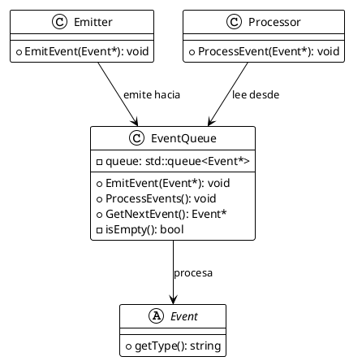
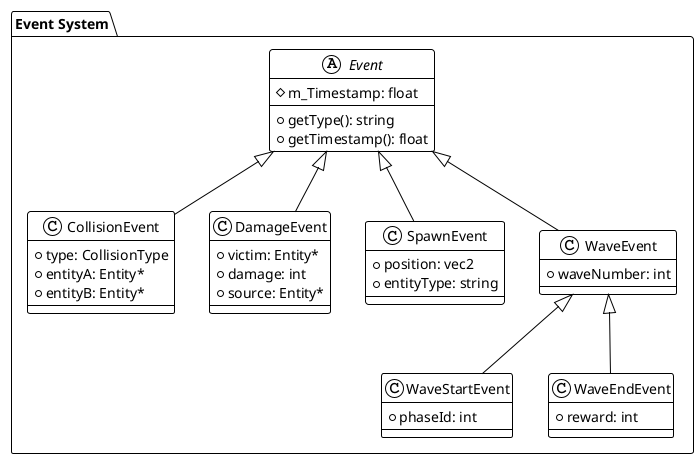
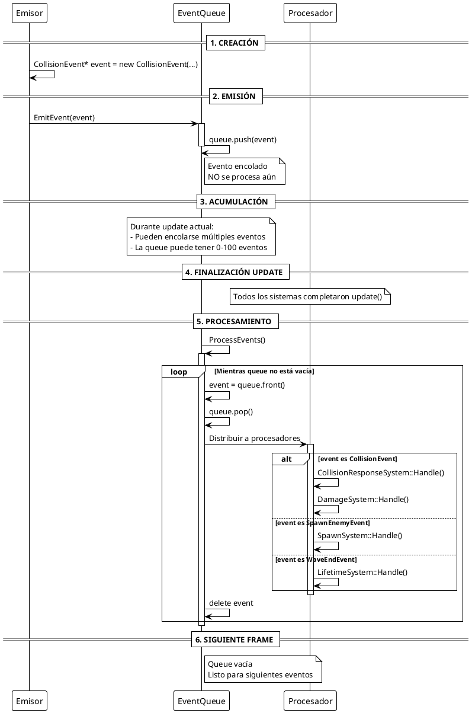
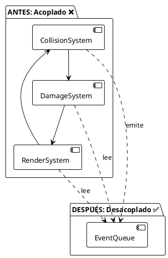

# 🎯 Manejo de Eventos - EXAMEN3

**Este documento explica cómo funciona el sistema de eventos en EXAMEN3, uno de los retos más importantes del proyecto.**

---

## Tabla de Contenidos

1. [Visión General](#visión-general)
2. [Arquitectura de Eventos](#arquitectura-de-eventos)
3. [Tipos de Eventos](#tipos-de-eventos)
4. [Ciclo de Vida de un Evento](#ciclo-de-vida-de-un-evento)
5. [Desacoplamiento entre Sistemas](#desacoplamiento-entre-sistemas)
6. [Ejemplos Prácticos](#ejemplos-prácticos)

---

## Visión General

### ¿Qué es un Sistema de Eventos?

Es un mecanismo que permite que **sistemas independientes se comuniquen sin conocerse directamente**.

```
SIN eventos (acoplado):
  CollisionSystem ──→ DamageSystem
  (directamente)
  ❌ Problemas: Dependencias cruzadas, difícil mantener

CON eventos (desacoplado):
  CollisionSystem ──→ [Event Queue] ──→ DamageSystem
  (a través de eventos)
  ✅ Beneficios: Independencia, flexibilidad, mantenibilidad
```

### Beneficios

| Beneficio | Descripción |
|-----------|-------------|
| **Desacoplamiento** | Los sistemas no necesitan conocerse |
| **Flexibilidad** | Fácil agregar nuevos procesadores de eventos |
| **Debuggabilidad** | Eventos se pueden loguear y rastrear |
| **Testabilidad** | Cada sistema se prueba independientemente |
| **Escalabilidad** | Agregar nuevos tipos de eventos es simple |

---

## Arquitectura de Eventos

### Estructura Base



### Implementación en World

```cpp
// World.h
class World
{
private:
    std::queue<Event*> m_EventQueue;  // ← Cola de eventos
    
public:
    // Emitir un evento
    void EmitEvent(Event* event) 
    {
        m_EventQueue.push(event);  // Encolar, no procesar aún
    }
    
    // Procesar todos los eventos
    void ProcessEvents()
    {
        while (!m_EventQueue.empty())
        {
            Event* event = m_EventQueue.front();
            m_EventQueue.pop();
            
            // Distribuir a procesadores
            // (cada sistema lee los tipos que le interesan)
            
            delete event;  // Liberar memoria
        }
    }
};
```

---

## Tipos de Eventos

### Jerarquía de Eventos



### Evento: CollisionEvent

**Propósito:** Notificar que dos entidades colisionaron

**Emitido por:** CollisionSystem

**Procesado por:** CollisionResponseSystem, DamageSystem

```cpp
// Event.h
enum class CollisionType
{
    PLAYER_ENEMY,
    ENEMY_ENEMY,
    ENTITY_WORLD,
    PLAYER_OBSTACLE,
    ENEMY_OBSTACLE
};

class CollisionEvent : public Event
{
public:
    CollisionType type;
    Entity* entityA;
    Entity* entityB;
    glm::vec2 collisionPoint;
    
    CollisionEvent(CollisionType t, Entity* a, Entity* b, glm::vec2 point)
        : type(t), entityA(a), entityB(b), collisionPoint(point) {}
    
    std::string getType() const override { return "COLLISION"; }
};
```

**Uso en CollisionSystem:**

```cpp
// CollisionSystem.cpp
void CollisionSystem::checkPlayerEnemyCollisions(World& world)
{
    Entity* player = world.GetPlayer();
    if (!player) return;
    
    const auto& enemies = world.GetEnemies();
    
    for (Entity* enemy : enemies)
    {
        if (checkAABBCollision(player, enemy))
        {
            // ¡Colisión detectada! Emitir evento
            auto collision = new CollisionEvent(
                CollisionType::PLAYER_ENEMY,
                player,
                enemy,
                glm::vec2(50, 50)  // punto de contacto
            );
            world.EmitEvent(collision);
        }
    }
}
```

### Evento: SpawnEnemyEvent

**Propósito:** Solicitar creación de un enemigo específico

**Emitido por:** WaveSystem

**Procesado por:** SpawnSystem

```cpp
// Event.h
class SpawnEnemyEvent : public Event
{
public:
    std::string enemyTypeName;  // "Enemigo1", "Enemigo2", etc
    float speedMultiplier;       // 1.0, 1.5, 2.0, etc
    
    SpawnEnemyEvent(const std::string& type, float speed = 1.0f)
        : enemyTypeName(type), speedMultiplier(speed) {}
    
    std::string getType() const override { return "SPAWN_ENEMY"; }
};
```

**Uso en WaveSystem:**

```cpp
// WaveSystem.cpp
void WaveSystem::update(World& world, float dt)
{
    m_WaveTimer += dt;
    m_SpawnTimer += dt;
    
    // Emitir spawn cada spawnInterval
    if (m_SpawnTimer >= m_Waves[m_CurrentWave].spawnInterval)
    {
        auto spawnEvent = new SpawnEnemyEvent(
            "Enemigo1",
            1.5f  // 50% más rápido en oleada 2
        );
        world.EmitEvent(spawnEvent);
        
        m_SpawnTimer = 0;
    }
}
```

**Procesamiento en SpawnSystem:**

```cpp
// SpawnSystem.cpp
void SpawnSystem::update(World& world, float dt)
{
    // En World::ProcessEvents() se llamará a esto
    // para cada SpawnEnemyEvent en la queue
    
    // Lógica para crear enemigo...
}
```

### Evento: WaveStartEvent

**Propósito:** Notificar que inició una nueva oleada

**Emitido por:** WaveSystem

**Procesado por:** HUDSystem, LifetimeSystem, otros

```cpp
class WaveStartEvent : public Event
{
public:
    int waveNumber;  // 0, 1, 2, 3, 4
    int phaseId;     // ID de fase para obstáculos
    
    WaveStartEvent(int wave, int phase)
        : waveNumber(wave), phaseId(phase) {}
    
    std::string getType() const override { return "WAVE_START"; }
};
```

### Evento: WaveEndEvent

**Propósito:** Notificar que terminó una oleada

**Emitido por:** WaveSystem

**Procesado por:** LifetimeSystem

```cpp
class WaveEndEvent : public Event
{
public:
    int waveNumber;
    
    WaveEndEvent(int wave) : waveNumber(wave) {}
    
    std::string getType() const override { return "WAVE_END"; }
};
```

---

## Ciclo de Vida de un Evento

### Etapas Detalladas



### Timing Crítico

```
Frame N (t = 16.67ms):
├─ Update Systems
│  ├─ Emiten eventos (encolados)
│  └─ Eventos NO se procesan aún
├─ Render
│  └─ [WaveManager.render() → ProcessEvents()]
│     └─ Aquí se procesan TODOS los eventos
└─ Siguiente frame

Ventaja:
✅ Eventos acumulados en un frame
✅ Se procesan una sola vez
✅ No hay race conditions
✅ Orden predecible
```

---

## Desacoplamiento entre Sistemas

### Antes: Acoplado Directo ❌

```cpp
// PROBLEMA: Sistemas directamente conectados

// CollisionSystem.h
class CollisionSystem
{
public:
    void RegisterDamageSystem(DamageSystem* damage) 
    {
        m_DamageSystem = damage;  // ← Referencia directa
    }
    
    void OnCollision(Entity* a, Entity* b)
    {
        // Llamar directamente al otro sistema
        m_DamageSystem->ApplyDamage(a, 1);  // ← Acoplamiento
    }
    
private:
    DamageSystem* m_DamageSystem;  // ← Depende de DamageSystem
};

// Problemas:
// 1. CollisionSystem DEBE conocer a DamageSystem
// 2. Si cambio DamageSystem, debo cambiar CollisionSystem
// 3. Difícil testear CollisionSystem sin DamageSystem
// 4. No puedo tener múltiples procesadores de daño
// 5. Orden de ejecución está hardcodeado
```

### Después: Desacoplado con Eventos ✅

```cpp
// SOLUCIÓN: Sistemas comunicados por eventos

// CollisionSystem.h
class CollisionSystem : public ISystem
{
public:
    void update(World& world, float dt) override
    {
        // Detectar colisión
        if (checkAABBCollision(entityA, entityB))
        {
            // Emitir evento (no sé quién lo procesará)
            auto event = new CollisionEvent(type, entityA, entityB);
            world.EmitEvent(event);  // ← Desacoplado
        }
    }
};

// DamageSystem.h
class DamageSystem : public ISystem
{
public:
    void update(World& world, float dt) override
    {
        // Leer eventos (no sé de dónde vinieron)
        CollisionEvent* event = world.GetEvent<CollisionEvent>();
        
        if (event && event->type == PLAYER_ENEMY)
        {
            event->victim->GetComponent<HealthComponent>()->takeDamage(1);
        }
    }
};

// Ventajas:
// ✅ CollisionSystem NO conoce a DamageSystem
// ✅ Puedo agregar más procesadores sin cambiar nada
// ✅ Fácil testear cada sistema por separado
// ✅ Orden de procesamiento es flexible
// ✅ Máxima reutilización
```

### Diagrama Conceptual



---

## Ejemplos Prácticos

### Ejemplo 1: Flujo Completo de Colisión

```cpp
// === FRAME N: UPDATE PHASE ===

// 1. CollisionSystem detecta colisión
CollisionSystem::update(world, dt)
{
    if (checkAABBCollision(player, enemy))
    {
        // Crear evento (sin procesar)
        CollisionEvent* evt = new CollisionEvent(PLAYER_ENEMY, player, enemy);
        
        // Emitir a queue
        world.EmitEvent(evt);  // ← Encolado
    }
}

// 2. Otros sistemas continúan ejecutándose
// El evento está encolado pero NO procesado

// === FRAME N: RENDER PHASE ===

// 3. WaveManagerSystem.render() → ProcessEvents()
WaveManagerSystem::render(world)
{
    // Procesar TODOS los eventos encolados
    world.ProcessEvents();
}

// 4. En ProcessEvents() se distribuyen eventos
world.ProcessEvents()
{
    while (!eventQueue.empty())
    {
        Event* evt = eventQueue.front();
        eventQueue.pop();
        
        // CollisionResponseSystem procesa
        if (auto collision = dynamic_cast<CollisionEvent*>(evt))
        {
            // Empujar entidades para evitar solapamiento
            float pushStrength = 10.0f;
            collision->entityA->pos += pushDir * pushStrength;
            collision->entityB->pos -= pushDir * pushStrength;
        }
        
        delete evt;
    }
}

// === FRAME N+1: UPDATE PHASE ===
// 5. El siguiente frame el evento ya fue procesado
// Y un nuevo evento podría haber sido emitido

// Resultado:
// ✅ Eventos procesados DESPUÉS de todos los updates
// ✅ Orden predecible
// ✅ Sin race conditions
```

### Ejemplo 2: Spawn de Enemigos

```cpp
// === FRAME 0: Wave inicia ===

WaveSystem::update()
{
    // Emitir WaveStartEvent
    world.EmitEvent(new WaveStartEvent(0, 0));
}

// === FRAME 0.5 (intervalo de spawn) ===

WaveSystem::update()
{
    if (spawnTimer >= spawnInterval)
    {
        // Emitir SpawnEnemyEvent
        world.EmitEvent(new SpawnEnemyEvent("Enemigo1", 1.0f));
        
        // Enemigo NO se crea aún
        spawnTimer = 0;
    }
}

// === FRAME 0: RENDER PHASE ===

world.ProcessEvents()
{
    // Procesar SpawnEnemyEvent
    SpawnEnemyEvent* spawnEvent = ...;
    
    // Crear enemigo en este momento
    Entity* enemy = world.createEntity();
    enemy->AddComponent<Transform>(randomX, randomY);
    enemy->AddComponent<Sprite>(renderer, "Enemy1.png");
    enemy->AddComponent<Health>(1, 1);
    enemy->AddComponent<Enemy>(200, 400, 0.1f);
    
    // Enemigo ahora está en el mundo
    // Siguiente frame podrá ser movido, renderizado, etc
}

// === FRAME 1: ===
// Enemigo está en el mundo y recibe los sistemas
```

### Ejemplo 3: Fin de Oleada

```cpp
// === FRAME 8: Oleada termina ===

WaveSystem::update(dt)
{
    waveTimer += dt;
    
    if (waveTimer >= waveDuration)
    {
        // Emitir WaveEndEvent
        world.EmitEvent(new WaveEndEvent(0));
        waveTimer = 0;
        currentWave++;
    }
}

// === FRAME 8: RENDER PHASE ===

world.ProcessEvents()
{
    // LifetimeSystem procesa WaveEndEvent
    WaveEndEvent* waveEnd = ...;
    
    // Eliminar todos los enemigos de esta oleada
    const auto& enemies = world.GetEnemies();
    for (Entity* enemy : enemies)
    {
        world.deleteEntity(enemy);
    }
    
    // Eliminar todos los obstáculos
    const auto& obstacles = world.GetObstacles();
    for (Entity* obstacle : obstacles)
    {
        world.deleteEntity(obstacle);
    }
}

// === FRAME 9: Siguiente oleada ===
// Enemigos y obstáculos han sido eliminados
// Wave 1 comienza limpiamente
```

---

## Desafíos Resueltos

### Desafío 1: ¿Cuándo Procesar Eventos?

**Problema:** Si los eventos se procesan inmediatamente, pueden ocurrir situaciones inconsistentes.

```cpp
// ❌ INCORRECTO: Procesar inmediatamente
CollisionSystem::update()
{
    if (collision)
    {
        // Procesar inmediatamente
        world.EmitEvent(event);  // Se procesa AQUÍ
        // El estado del mundo cambia a mitad de update
        // Otros sistemas ven un mundo inconsistente
    }
}

// ✅ CORRECTO: Procesar después de todos los updates
// Los eventos se procesan después de que TODOS los sistemas
// hayan completado su update() para ese frame
```

**Solución:** Procesar eventos al final del frame en `WaveManagerSystem.render()`

### Desafío 2: ¿Múltiples Procesadores del Mismo Evento?

**Problema:** ¿Qué si múltiples sistemas quieren procesar el mismo evento?

```cpp
// ✅ SOLUCIÓN: Distribuir a todos los interesados

world.ProcessEvents()
{
    while (!eventQueue.empty())
    {
        CollisionEvent* evt = (CollisionEvent*)eventQueue.front();
        eventQueue.pop();
        
        // TODOS los sistemas que lo necesiten pueden procesarlo
        
        // 1. CollisionResponseSystem lo procesa
        collisionResponseSystem.HandleCollision(evt);
        
        // 2. DamageSystem también lo procesa
        damageSystem.HandleCollision(evt);
        
        // 3. Otros sistemas pueden agregarse fácilmente
        
        delete evt;
    }
}
```

### Desafío 3: ¿Memory Leak en Eventos?

**Problema:** Los eventos se crean dinámicamente y deben ser liberados.

```cpp
// ✅ CORRECTO: Liberar en ProcessEvents()

world.ProcessEvents()
{
    while (!eventQueue.empty())
    {
        Event* evt = eventQueue.front();
        eventQueue.pop();
        
        // Procesar...
        
        delete evt;  // ← Liberar memoria
    }
}

// ⚠️ IMPORTANTE:
// - Los eventos creados con 'new' DEBEN ser eliminados
// - Se eliminan después de procesar
// - No hay memory leaks si se sigue este patrón
```

---

## Resumen

| Aspecto | Implementación |
|--------|-----------------|
| **Patrón** | Event-Driven Architecture |
| **Storage** | std::queue en World |
| **Timing** | Emitir durante update, procesar en render |
| **Desacoplamiento** | Máximo - sistemas completamente independientes |
| **Escalabilidad** | Fácil agregar nuevos tipos de eventos |
| **Performance** | O(1) para emitir, O(E) para procesar (E = eventos) |

---

**Siguiente:** Ver [UPDATE_RENDER_CYCLE.md](./UPDATE_RENDER_CYCLE.md) para detalles del ciclo update-render
