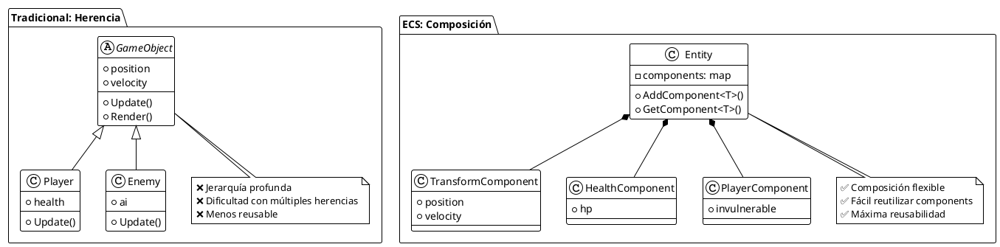
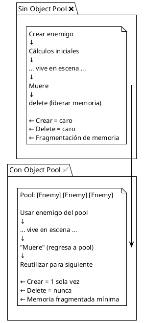
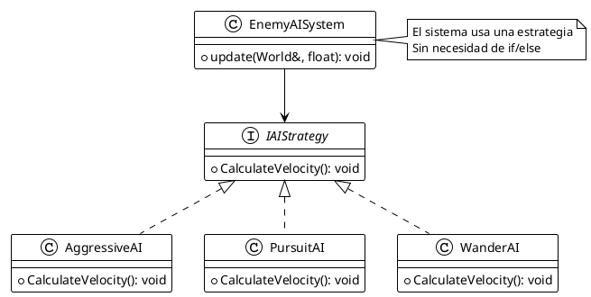

# 🎨 Patrones de Diseño - EXAMEN3

Documentación de los patrones de diseño implementados en el proyecto.

---

## Tabla de Contenidos

1. [Entity Component System (ECS)](#entity-component-system-ecs)
2. [Event-Driven Architecture](#event-driven-architecture)
3. [Object Pool Pattern](#object-pool-pattern)
4. [Strategy Pattern](#strategy-pattern)
5. [Template Method Pattern](#template-method-pattern)
6. [Factory Pattern](#factory-pattern)
7. [Comparativa Antes/Después](#comparativa-antesantes)

---

## Entity Component System (ECS)

### Concepto

ECS es un patrón arquitectónico que separa:
- **Entidades:** Contenedores de componentes (ID único)
- **Componentes:** Datos puros (posición, velocidad, vida, etc)
- **Sistemas:** Lógica que procesa entidades con ciertos componentes



### Implementación en EXAMEN3

```cpp
// Entity.h - Contenedor de componentes
class Entity
{
private:
    uint32_t m_ID;
    std::map<std::string, Component*> m_Components;
    
public:
    // Agregar un componente
    template<typename T, typename... Args>
    T* AddComponent(Args&&... args)
    {
        T* component = new T(std::forward<Args>(args)...);
        component->SetEntity(this);
        m_Components[typeid(T).name()] = component;
        return component;
    }
    
    // Obtener un componente
    template<typename T>
    T* GetComponent()
    {
        auto it = m_Components.find(typeid(T).name());
        if (it != m_Components.end())
            return dynamic_cast<T*>(it->second);
        return nullptr;
    }
    
    // Verificar si tiene componente
    template<typename T>
    bool HasComponent()
    {
        return m_Components.find(typeid(T).name()) != m_Components.end();
    }
};

// Ejemplo: Crear un jugador
Entity* player = world.createEntity();
player->AddComponent<TransformComponent>(100, 100);
player->AddComponent<SpriteComponent>(renderer, "player.png");
player->AddComponent<HealthComponent>(10, 10);
player->AddComponent<PlayerComponent>();

// Sistemas procesan entidades con ciertos componentes
// MovementSystem: itera entidades con Transform + Velocity
// RenderSystem: itera entidades con Transform + Sprite + Collider
// HealthSystem: itera entidades con Health
```

### Ventajas

| Aspecto | Beneficio |
|---------|-----------|
| **Reusabilidad** | Componentes combinables sin herencia |
| **Rendimiento** | Mejor cache locality, datos contiguos |
| **Flexibilidad** | Agregar/remover comportamientos dinámicamente |
| **Testabilidad** | Sistemas y componentes independientes |
| **Escalabilidad** | Fácil agregar nuevos tipos de entidades |

---

## Event-Driven Architecture

### Concepto

Los sistemas se comunican mediante eventos en lugar de referencias directas.

```
Sistema A → [Event Queue] → Sistema B
(desacoplado)

vs

Sistema A → Sistema B
(acoplado)
```

### Implementación en EXAMEN3

```cpp
// Event.h - Base de eventos
abstract class Event
{
public:
    virtual std::string getType() const = 0;
    virtual ~Event() = default;
};

// Tipos de eventos específicos
class CollisionEvent : public Event
{
public:
    CollisionType type;
    Entity* entityA;
    Entity* entityB;
};

class SpawnEnemyEvent : public Event
{
public:
    std::string enemyType;
    float speedMultiplier;
};

// World.h - Cola de eventos
class World
{
private:
    std::queue<Event*> m_EventQueue;
    
public:
    void EmitEvent(Event* event)
    {
        m_EventQueue.push(event);  // Encolar, no procesar
    }
    
    void ProcessEvents()
    {
        while (!m_EventQueue.empty())
        {
            Event* event = m_EventQueue.front();
            m_EventQueue.pop();
            
            // Distribuir a procesadores
            // CollisionResponseSystem::Handle(event)
            // DamageSystem::Handle(event)
            
            delete event;
        }
    }
};

// Uso en sistemas
void CollisionSystem::update(World& world, float dt)
{
    if (collision detected)
    {
        // Emitir evento (no procesar inmediatamente)
        world.EmitEvent(new CollisionEvent(PLAYER_ENEMY, player, enemy));
    }
}

void DamageSystem::update(World& world, float dt)
{
    // Procesar eventos después de todos los updates
    // world.ProcessEvents() se llama en WaveManagerSystem::render()
}
```

### Ventajas

```
✅ Desacoplamiento: Sistemas no se conocen
✅ Flexibilidad: Agregar nuevos procesadores sin cambiar existentes
✅ Claridad: Comunicación explícita mediante eventos
✅ Debuggabilidad: Eventos se pueden loguear
✅ Escalabilidad: Agregar nuevos tipos de eventos es simple
```

---

## Object Pool Pattern

### Concepto

Reutilizar objetos en lugar de crear/destruir constantemente.



### Implementación en EXAMEN3

```cpp
// Implícito en nuestro sistema:
// Los enemigos se crean en SpawnEnemyEvent
// Se destruyen en WaveEndEvent
// El pool es el vector de enemigos en World

class World
{
private:
    std::vector<Entity*> m_Entities;      // Pool general
    std::vector<Entity*> m_EnemyEntities; // Subpool de enemigos
    std::vector<Entity*> m_ObstacleEntities; // Subpool de obstáculos
    
public:
    Entity* createEntity()
    {
        // Crear una sola vez
        Entity* entity = new Entity(nextId++);
        m_Entities.push_back(entity);
        return entity;
    }
    
    void deleteEntity(Entity* entity)
    {
        // El pool se mantiene limpio
        // Importante: limpiar referencias antes
        m_Entities.erase(...);
        delete entity;
    }
};

// Ventaja: Las entidades se reutilizan cuando es posible
// Desventaja: Requiere limpieza explícita (WaveEndEvent)
```

### Beneficios

```
✅ Rendimiento: Evita allocations/deallocations repetidas
✅ Memoria: Patrón de acceso predecible
✅ Latencia: Sin spikes de GC/deallocation
✅ Cache: Mejor localidad de datos
```

---

## Strategy Pattern

### Concepto

Encapsular estrategias intercambiables (diferente IA por tipo de enemigo).



### Implementación en EXAMEN3

```cpp
// EnemyComponent.h - Parámetros de estrategia
class EnemyComponent : public Component
{
public:
    float baseSpeed;         // Estrategia: velocidad base
    float focusRange;        // Estrategia: rango de persecución
    float velocitySmoothing; // Estrategia: suavizado de cambios
};

// Configuración por tipo de enemigo
// Enemigo1: baseSpeed=200, focusRange=400, smoothing=0.1
// Enemigo2: baseSpeed=300, focusRange=200, smoothing=0.3
// Enemigo3: baseSpeed=150, focusRange=500, smoothing=0.05
// Enemigo4: baseSpeed=400, focusRange=100, smoothing=0.5

// EnemyAISystem.cpp - Aplicar estrategia
void EnemyAISystem::update(World& world, float dt)
{
    const auto& enemies = world.GetEnemies();
    
    for (Entity* enemy : enemies)
    {
        EnemyComponent* comp = enemy->GetComponent<EnemyComponent>();
        TransformComponent* transform = enemy->GetComponent<TransformComponent>();
        
        // Estrategia basada en componente
        if (comp->focusRange > 400)
        {
            // Persecución agresiva
            // ... lógica específica ...
        }
        else
        {
            // Estrategia conservadora
            // ... otra lógica ...
        }
    }
}

// Ventaja: Diferentes comportamientos sin if/else complejo
// Ventaja: Fácil agregar nuevos tipos editando JSON
```

---

## Template Method Pattern

### Concepto

Definir estructura de algoritmo en clase base, detalles en derivadas.

```cpp
// ISystem.h - Define contrato
struct ISystem
{
    virtual void update(World &world, float dt) = 0;
    virtual ~ISystem() = default;
};

// Cada sistema implementa detalles específicos
class MovementSystem : public ISystem
{
    void update(World &world, float dt) override
    {
        // Detalles específicos de movimiento
    }
};

class CollisionSystem : public ISystem
{
    void update(World &world, float dt) override
    {
        // Detalles específicos de colisiones
    }
};

// Game.cpp - Usa template consistentemente
void Game::Update(float dt)
{
    // Para cada sistema, llamar update() del mismo
    // Sin saber detalles específicos
    m_WaveManagerSystem->update(m_World, dt);
    m_PlayerInputSystem->update(m_World, dt);
    m_MovementSystem->update(m_World, dt);
    m_CollisionSystem->update(m_World, dt);
    // ... etc ...
}
```

### Beneficios

```
✅ Uniformidad: Todos los sistemas siguen el mismo patrón
✅ Polimorfismo: Llamadas uniformes a comportamientos distintos
✅ Extensibilidad: Agregar nuevo sistema es predecible
✅ Mantenibilidad: Cambios en estructura se hacen en un lugar
```

---

## Factory Pattern

### Concepto

Centralizar creación de objetos complejos.

```cpp
// EntityFactory.h
class EntityFactory
{
public:
    static Entity* CreatePlayer(World& world, SDL_Renderer* renderer);
    static Entity* CreateEnemy(World& world, SDL_Renderer* renderer,
                              const EnemyConfig& config);
    static Entity* CreateObstacle(World& world, SDL_Renderer* renderer,
                                 const ObstacleConfig& config);
};

// EntityFactory.cpp - Detalles de creación
Entity* EntityFactory::CreatePlayer(World& world, SDL_Renderer* renderer)
{
    Entity* player = world.createEntity();
    
    // Configuración garantizada
    player->AddComponent<TransformComponent>(960, 540);
    player->AddComponent<SpriteComponent>(renderer, "player.png");
    player->AddComponent<ColliderComponent>(94, 94);
    player->AddComponent<HealthComponent>(10, 10);
    player->AddComponent<PlayerComponent>();
    
    return player;
}

Entity* EntityFactory::CreateEnemy(World& world, SDL_Renderer* renderer,
                                   const EnemyConfig& config)
{
    Entity* enemy = world.createEntity();
    
    // Configuración por tipo
    enemy->AddComponent<TransformComponent>(config.x, config.y);
    enemy->AddComponent<SpriteComponent>(renderer, config.spritePath);
    enemy->AddComponent<ColliderComponent>(config.width, config.height);
    enemy->AddComponent<HealthComponent>(1, 1);
    enemy->AddComponent<EnemyComponent>(config.speed, config.range, config.smooth);
    
    return enemy;
}

// Uso: Garantiza inicialización correcta
Entity* player = EntityFactory::CreatePlayer(world, renderer);
Entity* enemy = EntityFactory::CreateEnemy(world, renderer, enemyConfig);
```

### Ventajas

```
✅ Consistencia: Creación uniforme garantizada
✅ Mantenibilidad: Cambios en creación en un lugar
✅ Abstracción: Detalles ocultos al usuario
✅ Validación: Verificar estado al crear
```

---

## Comparativa Antes/Después

### Escenario: Agregar Nuevo Sistema

#### ❌ Antes (Acoplado)

```cpp
// CollisionSystem.h
class CollisionSystem
{
public:
    void SetDamageSystem(DamageSystem* damage) { m_Damage = damage; }
    void SetResponseSystem(CollisionResponseSystem* response) { m_Response = response; }
    
    void update()
    {
        if (collision)
        {
            m_Damage->ApplyDamage(...);      // Acoplado directo
            m_Response->ResolveCollision(...); // Acoplado directo
        }
    }
    
private:
    DamageSystem* m_Damage;
    CollisionResponseSystem* m_Response;
};

// Problema: Agregar nuevo sistema requiere cambiar CollisionSystem
// Problema: No puedo usar CollisionSystem sin los otros
```

#### ✅ Después (Desacoplado con Eventos)

```cpp
// CollisionSystem.h
class CollisionSystem : public ISystem
{
public:
    void update(World& world, float dt) override
    {
        if (collision)
        {
            world.EmitEvent(new CollisionEvent(...));  // Solo emite
        }
    }
};

// DamageSystem.h
class DamageSystem : public ISystem
{
public:
    void update(World& world, float dt) override
    {
        // Lee eventos que le interesan
        // No necesita conocer CollisionSystem
    }
};

// Ventaja: Agregar nuevo sistema sin cambiar nada existente
// Ventaja: Cada sistema completamente independiente
```

---

## Resumen de Patrones

| Patrón | Propósito | Beneficio |
|--------|-----------|-----------|
| **ECS** | Separar datos de lógica | Máxima composición y reusabilidad |
| **Event-Driven** | Comunicación desacoplada | Sistemas independientes |
| **Object Pool** | Reutilizar objetos | Mejor rendimiento y memoria |
| **Strategy** | Estrategias intercambiables | Fácil extender comportamientos |
| **Template Method** | Estructura uniforme | Consistencia y mantenibilidad |
| **Factory** | Creación centralizada | Inicialización garantizada |

---

## Aplicación en el Proyecto

```
┌─────────────────────────────────────────┐
│         EXAMEN3 Architecture            │
├─────────────────────────────────────────┤
│                                         │
│  ┌─ Entity Component System (ECS)      │
│  │  └─ 7 Components + 12 Systems       │
│  │     └─ Composición flexible         │
│  │                                     │
│  ├─ Event-Driven Architecture          │
│  │  └─ 8 Tipos de eventos              │
│  │     └─ Sistemas desacoplados        │
│  │                                     │
│  ├─ Object Pool (implícito)            │
│  │  └─ Reutilización de entidades      │
│  │     └─ Mejor rendimiento            │
│  │                                     │
│  ├─ Strategy Pattern                   │
│  │  └─ 4 tipos de enemigos             │
│  │     └─ Comportamientos diferentes   │
│  │                                     │
│  ├─ Template Method Pattern            │
│  │  └─ ISystem interfaz común          │
│  │     └─ 12 implementaciones únicas   │
│  │                                     │
│  └─ Factory Pattern                    │
│     └─ EntityFactory centralizado      │
│        └─ Creación garantizada         │
│                                         │
└─────────────────────────────────────────┘

Resultado: Arquitectura robusta, escalable y mantenible ✅
```

---

## Conclusión

El proyecto utiliza una **combinación estratégica de patrones** que trabajan juntos:

1. **ECS** proporciona estructura flexible
2. **Event-Driven** proporciona desacoplamiento
3. **Strategy** proporciona extensibilidad
4. **Factory** proporciona consistencia
5. **Template Method** proporciona uniformidad

Esto resulta en código:
- ✅ Reusable (componentes intercambiables)
- ✅ Mantenible (sistemas independientes)
- ✅ Escalable (fácil agregar nuevas cosas)
- ✅ Performante (optimizaciones aplicadas)
- ✅ Testeable (cada pieza por separado)

