# 📊 Diagramas de Secuencia - EXAMEN3

Diagramas de secuencia detallados que muestran la interacción entre componentes en escenarios clave.

---

## 1. Inicio del Juego


---

## 2. Spawn de Enemigos


---

## 3. Sistema de Colisiones


---

## 4. Sistema de IA de Enemigos

```plantuml
@startuml EnemyAI
title Secuencia: Comportamiento de IA de Enemigos

participant "EnemyAISystem" as AI
participant "Enemy\nEntity" as EN
participant "Transform\nComponent" as TC
participant "Enemy\nComponent" as EC
participant "Player\nEntity" as PE

== Cada Frame ==
AI -> AI: Para cada entidad con EnemyComponent

AI -> EN: GetComponent<EnemyComponent>()
AI -> EN: GetComponent<TransformComponent>()

== Cálculo de IA ==
AI -> PE: world.GetPlayer()

AI -> AI: Calcular distancia al jugador

alt distancia < focusRange
  
  note right of AI
    Jugador está en rango de visión
  end note
  
  AI -> AI: Calcular vector hacia jugador
  AI -> AI: Normalizar dirección
  AI -> AI: velocity_desired = direction * baseSpeed
  
else distancia >= focusRange
  
  note right of AI
    Jugador fuera de rango
  end note
  
  AI -> AI: velocity_desired = (0, 0)
  
end

== Suavizado con Lerp ==
AI -> TC: GetVelocity()

AI -> AI: velocity_actual = GetVelocity()

AI -> AI: velocity_smooth = Lerp(
  velocity_actual, 
  velocity_desired, 
  velocitySmoothing
)

note right of AI
  Lerp = actual + (desired - actual) * factor
  Factor pequeño = cambios lentos
  Factor grande = cambios rápidos
end note

AI -> TC: SetVelocity(velocity_smooth)

note right of AI
  En siguiente frame:
  MovementSystem aplicará:
  pos += velocity_smooth * dt
end note

@enduml
```

---

## 5. Invulnerabilidad del Jugador


---

## 6. Ciclo de Oleadas

```plantuml
@startuml WaveCycle
title Secuencia: Ciclo Completo de una Oleada

participant "WaveSystem" as W
participant "World" as WO
participant "SpawnSystem" as S
participant "Systems" as SYS
participant "LifetimeSystem" as L

== INICIO DE OLEADA ==
W -> W: m_CurrentWave = 0
W -> W: m_WaveTimer = 0
W -> W: m_SpawnTimer = 0

W -> WO: EmitEvent(WaveStartEvent(0, 0))
note right of W
  Notifica que inició oleada 0
  Phase 0 para obstáculos
end note

== DURANTE OLEADA ==
loop Mientras m_WaveTimer < duration

  W -> W: m_WaveTimer += deltaTime
  W -> W: m_SpawnTimer += deltaTime
  
  alt m_SpawnTimer >= spawnInterval
    
    W -> S: EmitEvent(SpawnEnemyEvent)
    note right of W
      Spawn de un enemigo
    end note
    
    W -> W: m_SpawnTimer = 0
    W -> W: m_EnemiesSpawnedInWave++
    
  end
  
  SYS -> SYS: Resto de sistemas (Physics, Collisions, etc)
  
end

== FIN DE OLEADA ==
W -> W: m_WaveTimer >= duration

W -> WO: EmitEvent(WaveEndEvent(0))
note right of W
  Notifica fin de oleada 0
end note

W -> W: m_WaveEnded = true

== LIMPIEZA ==
L -> WO: Procesa WaveEndEvent

L -> SYS: Eliminar todos los enemigos
activate SYS
  loop Para cada enemigo
    SYS -> SYS: DeleteEntity(enemy)
    note right of SYS
      Libera memoria
      Actualiza caches
    end
  end
deactivate SYS

L -> SYS: Eliminar todos los obstáculos
note right of L
  Limpia estado de oleada anterior
end note

== TRANSICIÓN ==
W -> W: NextWave()
activate W
  W -> W: m_CurrentWave++
  W -> W: m_WaveTimer = 0
  W -> W: m_WaveEnded = false
deactivate W

alt m_CurrentWave < totalWaves
  W -> W: StartWave(m_CurrentWave)
  note right of W
    Inicia siguiente oleada
    Repite ciclo
  end note
else m_CurrentWave >= totalWaves
  note right of W
    ¡Juego ganado!
  end note
end

@enduml
```



---

## 7. Procesamiento de Eventos


---

## 8. Flujo Frame-Rate Independent


---

## 9. Optimización HashMap O(1)


---

## Resumen de Secuencias Críticas

| Secuencia | Duración típica | Puntos críticos |
|-----------|-----------------|-----------------|
| Spawn enemigo | <1ms | Posición aleatoria, configuración |
| Detección colisión | ~2ms | AABB checks (múltiples pares) |
| Resolución colisión | ~1ms | Push physics, confinamiento |
| IA enemigos | ~1ms | Distancia, Lerp suavizado |
| Renderizado | ~5ms | SDL_RenderTexture por sprite |
| **Total por frame @ 60 FPS** | **<10ms** | **Frame time budget: 16.67ms** |

---

**Siguiente:** Ver [EVENT_MANAGEMENT.md](./EVENT_MANAGEMENT.md) para detalles del sistema de eventos
