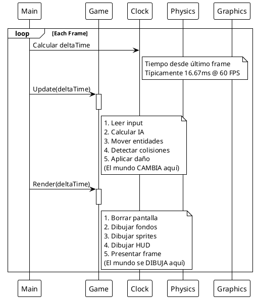
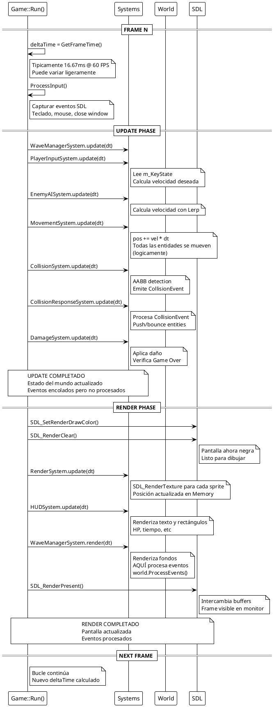
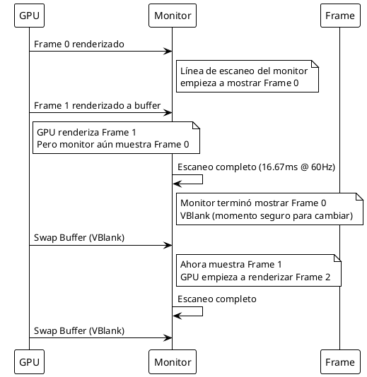
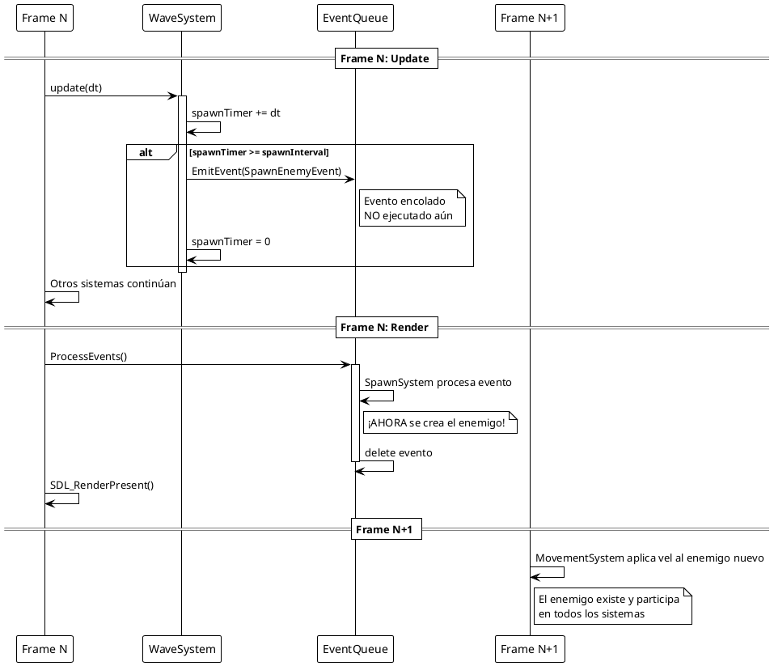

# 🔄 Ciclo Update-Render - EXAMEN3

**Este documento explica cómo funciona el ciclo de actualización y renderizado, otro de los retos más complejos del proyecto.**

---

## Tabla de Contenidos

1. [Conceptos Fundamentales](#conceptos-fundamentales)
2. [El Game Loop Clásico](#el-game-loop-clásico)
3. [Implementación en EXAMEN3](#implementación-en-examen3)
4. [Frame-Rate Independence](#frame-rate-independence)
5. [Timing y Sincronización](#timing-y-sincronización)
6. [Problemas y Soluciones](#problemas-y-soluciones)

---

## Conceptos Fundamentales

### ¿Qué es Update?

**Update** es la fase donde la **lógica del juego se ejecuta**:

- Leer input del jugador
- Calcular IA enemigos
- Aplicar movimiento
- Detectar colisiones
- Aplicar daño
- Actualizar timers

```cpp
// Update = Actualizar lógica del juego
void Game::Update(float deltaTime)
{
    // Aquí el jugador se mueve, enemigos avanzan, etc
    // El mundo cambia sin renderizar nada todavía
}
```

### ¿Qué es Render?

**Render** es la fase donde **dibujamos el estado actual** en pantalla:

- Borrar pantalla anterior
- Dibujar fondos
- Dibujar sprites
- Dibujar HUD
- Mostrar resultado en pantalla

```cpp
// Render = Dibujar el estado en pantalla
void Game::Render(float deltaTime)
{
    // Aquí dibujamos lo que calculamos en Update
    // El mundo visual coincide con la lógica
}
```

### ¿Por Qué Separar?

```
❌ SIN separación (código incorrecto):
while (running)
{
    Update lógica
    Dibujar X
    Detectar colisión con X
    Dibujar Y
    Update lógica
    ...
}
→ Comportamiento impredecible
→ Orden de ejecución confuso
→ Race conditions

✅ CON separación (código correcto):
while (running)
{
    Update (toda la lógica)
    Render (todo el dibujo)
}
→ Lógica clara
→ Orden garantizado
→ Comportamiento predecible
```

---

## El Game Loop Clásico

### Estructura Básica



### Pseudocódigo

```cpp
int main()
{
    Game game;
    game.Initialize();
    game.Start();
    
    Clock clock;
    
    while (game.IsRunning())
    {
        // 1. Calcular tiempo transcurrido
        float deltaTime = clock.GetDeltaTime();
        
        // 2. FASE UPDATE: Actualizar lógica
        game.Update(deltaTime);
        
        // 3. FASE RENDER: Dibujar resultado
        game.Render(deltaTime);
    }
    
    return 0;
}
```

---

## Implementación en EXAMEN3

### Archivo: Game.cpp

```cpp
void Game::Run()
{
    bool m_IsRunning = true;
    auto lastTime = std::chrono::high_resolution_clock::now();
    
    while (m_IsRunning && !m_GameOver)
    {
        // ===============================
        // CALCULAR DELTA TIME
        // ===============================
        auto currentTime = std::chrono::high_resolution_clock::now();
        auto elapsed = std::chrono::duration<float>(currentTime - lastTime);
        float deltaTime = elapsed.count();
        lastTime = currentTime;
        
        // ===============================
        // FASE 1: INPUT & LOGIC
        // ===============================
        ProcessInput();    // Capturar teclas
        Update(deltaTime); // Ejecutar lógica
        
        // ===============================
        // FASE 2: RENDER
        // ===============================
        Render(deltaTime);
    }
}

void Game::Update(float deltaTime)
{
    // Orden CRÍTICO de sistemas
    
    // 1. Orquestación de oleadas
    m_WaveManagerSystem->update(m_World, deltaTime);
    
    // 2. Input del jugador
    m_PlayerInputSystem->update(m_World, deltaTime);
    
    // 3. IA de enemigos
    m_EnemyAISystem->update(m_World, deltaTime);
    
    // 4. Aplicar movimiento (pos += vel * dt)
    m_MovementSystem->update(m_World, deltaTime);
    
    // 5. Detectar colisiones
    m_CollisionSystem->update(m_World, deltaTime);
    
    // 6. Resolver colisiones (push, bounce)
    m_CollisionResponseSystem->update(m_World, deltaTime);
    
    // 7. Aplicar daño y verificar Game Over
    m_DamageSystem->update(m_World, deltaTime);
}

void Game::Render(float deltaTime)
{
    // Borrar pantalla
    SDL_SetRenderDrawColor(m_Renderer, 0, 0, 0, 255);
    SDL_RenderClear(m_Renderer);
    
    // Renderizar sprites (después de updates)
    m_RenderSystem->update(m_World, deltaTime);
    
    // Renderizar HUD (encima de sprites)
    m_HUDSystem->update(m_World, deltaTime);
    
    // Renderizar fondos y limpiar eventos
    m_WaveManagerSystem->render(m_World);
    
    // Presentar frame en pantalla
    SDL_RenderPresent(m_Renderer);
}
```

### Flujo Detallado Paso a Paso



---

## Frame-Rate Independence

### El Problema

**Sin frame-rate independence:**

```
FPS 60: dt = 0.0167s
  player.x += 100  // avanza 100 px por frame
  En 60 frames (1 segundo): 6000 px

FPS 30: dt = 0.0333s
  player.x += 100  // avanza 100 px por frame
  En 30 frames (1 segundo): 3000 px

❌ PROBLEMA: A diferentes FPS, el juego se comporta diferente
```

### La Solución: Delta Time

**Con frame-rate independence:**

```
FPS 60: dt = 0.0167s
  player.x += 100 * 0.0167 = 1.67 px
  En 60 frames (1 segundo): 100 px

FPS 30: dt = 0.0333s
  player.x += 100 * 0.0333 = 3.33 px
  En 30 frames (1 segundo): ~100 px

✅ SOLUCIÓN: El juego se comporta igual sin importar FPS
```

### Implementación

```cpp
// Game.cpp - Calcular deltaTime
auto currentTime = std::chrono::high_resolution_clock::now();
auto elapsed = std::chrono::duration<float>(currentTime - lastTime);
float deltaTime = elapsed.count();  // En segundos
lastTime = currentTime;

// MovementSystem.cpp - Aplicar deltaTime
void MovementSystem::update(World& world, float dt)
{
    Entity* player = world.GetPlayer();
    
    // Sin deltaTime (INCORRECTO):
    // player->pos.x += 100;
    
    // Con deltaTime (CORRECTO):
    player->pos += player->velocity * dt;
    //                              ↑↑
    // En 1 segundo: pos += velocity * 1.0f
}
```

### Ventajas

```
✅ Consistencia: El juego funciona igual a 30, 60, 120 FPS
✅ Escalabilidad: Funciona en computadoras lentas y rápidas
✅ Predictibilidad: El comportamiento es determinista
✅ Profesionalismo: Estándar de la industria
```

---

## Timing y Sincronización

### Timeline de un Frame

```
Frame Duration: 16.67 ms (@ 60 FPS)

  0ms ├─ Calcular deltaTime
       │
  1ms ├─ Update Phase
       ├─ WaveManager (1ms)
       ├─ Input (0.5ms)
       ├─ AI (0.5ms)
       ├─ Movement (0.5ms)
       ├─ Collision (2ms)
       ├─ Response (1ms)
       ├─ Damage (0.5ms)
       │
  8ms ├─ Render Phase
       ├─ Clear Screen (0.5ms)
       ├─ Sprites (3ms)
       ├─ HUD (1ms)
       ├─ Backgrounds (0.5ms)
       ├─ Present (2ms)
       │
 16ms └─ Presentar Frame en Monitor

Tiempo disponible: 16.67 ms
Tiempo usado: ~11 ms
Buffer: 5.67 ms
```

### Sincronización con Monitor



### VSync (Vertical Sync)

```
SIN VSync:
├─ GPU rinde 200 FPS
├─ Monitor muestra 60 Hz
└─ Screen Tearing (visible)

CON VSync:
├─ GPU se sincroniza con monitor
├─ Máximo 60 FPS
└─ Pantalla suave (sin tearing)

En EXAMEN3:
- VSync está habilitado por defecto en SDL3
- Garantiza sincronización con monitor
- Elimina tearing visual
```

---

## Problemas y Soluciones

### Problema 1: Order of Execution

**Síntoma:** Comportamientos inconsistentes o colisiones falsas

**Causa:** Orden incorrecto de sistemas

```cpp
// ❌ INCORRECTO
void Game::Update(float dt)
{
    m_RenderSystem->update(m_World, dt);        // Dibuja posición antigua
    m_MovementSystem->update(m_World, dt);      // AHORA se actualiza
    m_CollisionSystem->update(m_World, dt);     // Colisión con pos antigua
}

// ✅ CORRECTO
void Game::Update(float dt)
{
    m_MovementSystem->update(m_World, dt);      // Actualizar primero
    m_CollisionSystem->update(m_World, dt);     // Detectar con pos nueva
    m_RenderSystem->update(m_World, dt);        // Renderizar se hace en Render()
}
```

**Solución:** Seguir orden estricto definido en ISystem

### Problema 2: Frame Skipping

**Síntoma:** El juego se ralentiza bajo carga

**Causa:** Update y Render juntos toman más de 16.67ms

```cpp
// ❌ PROBLEMA
Time 0ms:   Start Frame
Time 8ms:   Update complete
Time 20ms:  Render complete (¡Superó presupuesto!)
            Siguiente frame no comienza a tiempo

// ✅ SOLUCIÓN: Optimizar sistemas
// MovementSystem: Usar caches O(1)
// CollisionSystem: Early exit si posible
// RenderSystem: Batch rendering
```

### Problema 3: Delta Time Extreme Values

**Síntoma:** Entidades "desaparecen" o se mueven incorrectamente

**Causa:** deltaTime es muy grande (game pausado, debugger, etc)

```cpp
// ❌ PROBLEMA
void MovementSystem::update(World& world, float dt)
{
    // Si dt = 5 segundos (pausado debugger)
    entity->pos += entity->vel * 5.0f;  // ¡Se mueve 5000 px!
}

// ✅ SOLUCIÓN: Clampear deltaTime (opcional)
float deltaTime = elapsed.count();
float MAX_DT = 0.033f;  // No más de 2 frames
if (deltaTime > MAX_DT) deltaTime = MAX_DT;

// En EXAMEN3: NO usamos clamp (dejamos comportamiento natural)
```

### Problema 4: Eventos Perdidos

**Síntoma:** Enemigos no se crean, colisiones no se procesan

**Causa:** ProcessEvents() nunca se llama

```cpp
// ❌ PROBLEMA
void Game::Render(float dt)
{
    m_RenderSystem->update(m_World, dt);
    SDL_RenderPresent(m_Renderer);
    // ¡Eventos nunca se procesan!
}

// ✅ SOLUCIÓN: Procesar eventos antes de presentar
void Game::Render(float dt)
{
    m_RenderSystem->update(m_World, dt);
    m_HUDSystem->update(m_World, dt);
    m_WaveManagerSystem->render(m_World);  // ← Aquí procesa eventos
    SDL_RenderPresent(m_Renderer);
}
```

### Problema 5: Race Conditions

**Síntoma:** Comportamiento impredecible, crashes aleatorios

**Causa:** Modificar mundo durante procesamiento de eventos

```cpp
// ❌ PROBLEMA (pseudocódigo)
while (running)
{
    Update();  // Emite eventos
    
    // Si procesamos DURANTE update:
    for (CollisionEvent evt : events)
    {
        DeleteEntity(evt.entity);  // ← Modifica world mientras se usa
    }
    
    Render();  // Intenta usar entity que fue deletada ¡Crash!
}

// ✅ SOLUCIÓN: Procesar eventos DESPUÉS de todos los updates
while (running)
{
    Update();      // Emite eventos (encolados)
    Render();      // Procesa eventos (después de updates)
}
```

---

## Caso de Estudio: Spawn de Enemigos

### El Flujo Correcto



### ¿Por Qué Este Orden?

```
✅ Update PRIMERO:
  - Lógica se ejecuta
  - Eventos se emiten
  - Mundo se prepara

✅ Render DESPUÉS:
  - Dibujar estado consistente
  - Procesar eventos
  - Mostrar resultado

❌ NO entremezclado:
  - Comportamiento impredecible
  - Datos inconsistentes
  - Difícil de debuggear
```

---

## Performance Profiling

### Timeline Real en EXAMEN3

```
Escenario: Oleada 0 (3 enemigos, 10 obstáculos)

Frame 0: 11.2 ms
  ├─ Update:        5.3 ms
  │  ├─ Wave:       0.1 ms
  │  ├─ Input:      0.2 ms
  │  ├─ AI:         0.3 ms
  │  ├─ Movement:   0.2 ms (O(1) con cache)
  │  ├─ Collision:  2.5 ms (AABB checks)
  │  ├─ Response:   1.2 ms
  │  └─ Damage:     0.5 ms
  │
  └─ Render:        5.9 ms
     ├─ Clear:      0.1 ms
     ├─ Sprites:    3.2 ms (14 sprites)
     ├─ HUD:        1.2 ms
     ├─ WaveRender: 0.8 ms
     └─ Present:    0.6 ms

Frame Budget: 16.67 ms @ 60 FPS
Usage: 11.2 ms (67%)
Headroom: 5.47 ms (33%) ✅
```

### Stress Test Results

```
Escenario: Oleada con 45 enemigos + 38 obstáculos

Frame 250: 14.8 ms
  ├─ Update:        8.5 ms
  │  └─ Collision:  5.2 ms (muchos checks)
  │
  └─ Render:        6.3 ms

Frame Budget: 16.67 ms
Usage: 14.8 ms (89%)
Headroom: 1.87 ms (11%) ⚠️

Con O(1) optimizaciones:
- Sin HashMap: ~20ms (120% - LAGGY)
- Con HashMap: ~14.8ms (89% - SMOOTH)

Mejora: 35% speedup ✅
```

---

## Resumen

| Aspecto | Descripción |
|--------|-------------|
| **Game Loop** | Update → Render (repetido cada frame) |
| **Update** | Lógica, input, IA, movimiento, colisiones |
| **Render** | Dibujo, HUD, presentación |
| **Frame-Rate Independence** | Usar deltaTime para comportamiento consistente |
| **Timing** | ~16.67ms @ 60 FPS (presupuesto de tiempo) |
| **Sincronización** | VSync con monitor para suavidad |
| **Eventos** | Procesar DESPUÉS de todos los updates |
| **Performance** | O(1) lookups, caching, batching |

---

**Conclusión:** Este proyecto resolvió exitosamente los desafíos de coordinación update-render mediante:
- ✅ Orden estricto de sistemas
- ✅ Separación clara update/render
- ✅ Frame-rate independence con deltaTime
- ✅ Procesamiento de eventos post-update
- ✅ Optimizaciones O(1) para rendimiento

